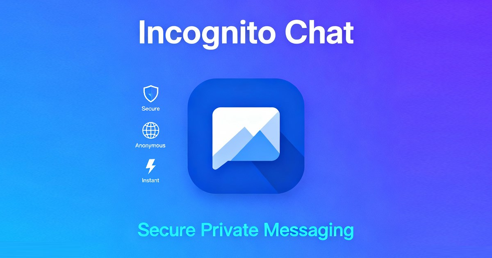

# Incognito Chat

> Anonymous, PIN-locked private chat rooms — a privacy-focused chat PWA.

<p align="center">
  <a href="https://konskall.github.io/incognitochat/">
    
  </a>
</p>


## Overview

Incognito Chat is an anonymous, installable chat PWA. You join or create a room with a name and a PIN, pick a username and avatar, and start chatting in real time — no account required (Google sign-in is optional, and is used to persist rooms and unlock paid plans). Rooms are private and PIN-locked, message contents are encrypted client-side, and access to every room is gated server-side by membership.

**Live demo:** https://konskall.github.io/incognitochat/

## ✨ Features

**Messaging**
- Real-time send/receive over Supabase Realtime, with paged history ("Load earlier") and reconnect/refocus resync
- Replies, reactions, edit/delete (optimistic with rollback), and pinned messages
- Polls (create, vote, close), emoji picker, in-room search, jump-to-bottom with new-message counter
- Typing indicators, online presence, and "Seen" read receipts

**Privacy & Rooms**
- Anonymous join or optional Google sign-in; DiceBear or custom-URL avatars
- Private, PIN-locked rooms with client-side message encryption (text, reply excerpts, and poll content)
- Dashboard of room cards: drag-to-reorder, favorites/pin-to-top, search, filters (all/owned/joined/unread/archived), mute, archive, owner-only rename, bulk delete, unread badges, last-message preview, and online-member avatars
- Disappearing messages (per-room TTL) and inactivity-based room auto-delete
- Free-tier rooms expire after 24h, with a live countdown pill and "auto-deleted" / re-create cards

**Calls & Media**
- WebRTC audio & video calls with group mesh, screen share, voice filters, and a minimized call bubble (launched from the participants panel)
- File / image / video attachments, voice notes with waveform playback, and a media gallery (media / files / links tabs)
- Location sharing rendered as an OpenStreetMap mini-map
- Rich link previews with YouTube embeds

**Notifications**
- Web Push notifications (VAPID)
- Per-room email alerts
- In-app sound and vibration cues (toggleable, persisted)

**AI**
- "Inco" — a per-room AI assistant triggered by mentioning or replying to `inco`, backed by Google Gemini server-side, with an optional custom AI avatar

**Personalization**
- Room wallpapers (preset categories + custom image) and room icons, propagated live
- Dark / light theme

**Monetization**
- Free / Basic / Ultra plans with Stripe Checkout and a billing portal
- Upgrade prompts, per-room daily message quota counter, and soft nudges

## 🛠 Tech Stack

- **React 18.2** + **Vite 5** SPA (TypeScript 5.2), no SSR/router framework
- **Tailwind CSS 3.4** (+ `tailwindcss-animate`, `autoprefixer`, `postcss 8.4`)
- **@supabase/supabase-js 2.39** — database, auth, realtime, and storage client
- **crypto-js 4.2** — client-side AES message encryption
- **lucide-react 0.303** — icons
- **@dnd-kit/core 6 / sortable 8 / utilities 3** — drag-and-drop room reordering
- **WebRTC** calls over a STUN + TURN ICE configuration — Google public STUN (`stun.l.google.com` / `stun1.l.google.com`) for NAT discovery plus metered.ca TURN relays (UDP/TCP 80, TLS 443) as fallback, with Supabase broadcast for signaling; calls are peer-to-peer where possible but relay through TURN when direct connectivity fails (so not strictly P2P)
- **Vitest 2** — unit tests; **terser** — production minification
- Hand-authored service worker + `site.webmanifest` (no Vite PWA plugin)

## 🏗 Architecture

The client is a Vite SPA with a hand-rolled view state machine (`landing` / `login` / `dashboard` / `chat`) coordinated with the History API instead of a router library. State is plain React (`useState`/`useEffect` + custom hooks such as `useChatMessages`, `useRoomPresence`, `useWebRTC`, `useIncoAI`, `useEntitlements`) — no Redux/Zustand. Screens are code-split via `React.lazy`, and heavy dependencies (`supabase-js`, `crypto-js`) are dynamically imported to keep the first paint light.

The backend is Supabase: **Postgres behind Row-Level Security**, **Realtime** channels, **Storage**, and **Edge Functions**. All room reads/writes are gated on **room membership** — the only way to become a member is the `join_or_create_room` `SECURITY DEFINER` RPC; direct inserts into the room/membership tables are blocked by RLS. Realtime drives messaging (`postgres_changes` on `messages`), presence (online + typing/seen via broadcast), room status, WebRTC call signaling, and a global dashboard-notifications channel. A single public `attachments` bucket stores message attachments, avatars, AI avatars, and room backgrounds.

| Edge Function | Purpose |
|---|---|
| `inco-ai` | Server-side Google Gemini proxy (with Search grounding) for the "Inco" assistant; holds the Gemini key server-side, applies a per-user rate limit, and returns text + sources. |
| `notify-room` | Sends per-room email alerts via EmailJS with an atomic cooldown; one email per recipient, no address leakage. |
| `send-push` | Delivers Web Push (VAPID) to subscribers, excluding the sender / online / muted users, dedupes endpoints, and prunes dead subscriptions. |
| `link-preview` | Fetches Open Graph metadata for link cards behind an SSRF guard, size cap, timeout, and rate limit. |
| `create-checkout-session` | Creates a Stripe Checkout subscription session for Basic/Ultra (non-anonymous users only). |
| `create-portal-session` | Returns a Stripe Billing Portal URL for managing an existing subscription. |
| `get-prices` | Public endpoint returning live Basic/Ultra prices from Stripe (short-lived cache). |
| `stripe-webhook` | Idempotent subscription sync — maps Stripe price → tier, upserts subscription state, and reconciles entitlements. |

## 🔐 Security & Privacy

**The honest model — client-side encryption layered on membership-gated access control. This is NOT zero-knowledge end-to-end encryption.**

- **Access control (primary):** Every room read/write is gated by **Row-Level Security on room membership** in Postgres. Membership can only be obtained through the `join_or_create_room` RPC, which verifies the PIN. Edge functions independently re-check membership before acting.
- **Client-side encryption (secondary):** Message text, reply excerpts, and poll content are encrypted **in the browser** with **AES-256-CBC** (random IV per message) using a key derived via `PBKDF2(pin, roomKey, 1000 iterations)` — where `roomKey` is built from the room name + PIN.
- **Authentication:** Supabase Auth with **anonymous sign-in** and optional **Google OAuth**. Sessions persist and auto-refresh.

> ⚠️ **Why this is not zero-knowledge / E2EE.** The room PIN is sent to the server (in plaintext) so the `join_or_create_room` RPC can verify it. Because the encryption key is derived solely from the PIN and room name — both known server-side — **the server is fully capable of deriving room keys and decrypting messages.** In addition, message metadata (`username`, `avatar_url`) is stored unencrypted, the `attachments` bucket is public, and PBKDF2 uses a low iteration count (1000) with a salt derived from the room name + PIN (both known to the server) and short PINs (4–12 chars per `ROOM_PIN_RE`), so the encryption layer is best understood as obfuscation on top of access control — **not** a guarantee that no one but the participants can read messages. Do not treat Incognito Chat as a confidential channel against a server-side adversary.

The shipped Supabase URL and anon key are public RLS-scoped values by design. All sensitive secrets (Gemini, Stripe, VAPID, EmailJS, service-role key) live **only** as Edge Function secrets and are never bundled into the client.

## 💳 Plans

`null` means unlimited / permanent. The database is authoritative; the client mirrors these limits for instant gating.

| Capability | Free | Basic (€5/mo) | Ultra (€10/mo) |
|---|---|---|---|
| Messages / room / day | 10 | 100 | unlimited |
| Max rooms | 1 | 10 | unlimited |
| Max attachment size | 10 MB | 10 MB | 40 MB |
| Room lifetime | 24 hours | permanent | permanent |
| Audio calls | ✗ | ✓ | ✓ |
| Video calls | ✗ | ✗ | ✓ |
| Screen share | ✗ | ✗ | ✓ |
| Room appearance (wallpapers/icons) | ✗ | ✓ | ✓ |
| Disappearing / custom auto-delete | ✗ | ✓ | ✓ |
| Email alerts | ✗ | ✓ | ✓ |
| AI assistant ("Inco") | ✗ | ✗ | ✓ |

Tier resolution: no subscription ⇒ `free`; otherwise entitled if Stripe status is `active`/`trialing` (or `past_due`/`canceled` while still within the current period), else `free`.

## 📁 Project Structure

```
incognitochat/
├── index.html                 # Entry HTML: title, PWA meta, OG/Twitter, JSON-LD
├── index.tsx                  # App bootstrap + service worker registration
├── App.tsx                    # View state machine (landing/login/dashboard/chat)
├── vite.config.ts             # base: '/incognitochat/', manual vendor chunks
├── package.json
├── components/                # UI: LoginScreen, DashboardScreen, ChatScreen,
│                              #   ChatInput, MessageList, CallManager, modals, etc.
├── hooks/                     # useChatMessages, useRoomPresence, useWebRTC,
│                              #   useIncoAI, useEntitlements, useMessageQuota, …
├── services/
│   ├── supabase.ts            # createClient + joinOrCreateRoom RPC wrapper
│   └── supabaseConfig.ts      # Public Supabase URL + anon key constants
├── utils/                     # crypto, helpers (generateRoomKey), entitlements,
│                              #   roomBackgrounds, roomLifecycle, pushService, …
├── supabase/
│   └── functions/             # 8 Deno Edge Functions (see Architecture table)
├── public/
│   ├── sw.js                  # Hand-authored service worker
│   └── site.webmanifest       # PWA manifest
└── .github/workflows/
    ├── deploy.yml             # Build + deploy to GitHub Pages on push to main
    └── keep-alive.yml         # Daily cron to keep Supabase from pausing
```

## 🚀 Getting Started

### Prerequisites
- **Node.js 22** (matches the CI/deploy runner)
- A Supabase project (for backend, auth, realtime, and storage)

### Install & run

```bash
git clone https://github.com/konskall/incognitochat.git
cd incognitochat
npm install
npm run dev      # start the Vite dev server
```

Build and preview a production bundle:

```bash
npm run build    # tsc && vite build  → ./dist
npm run preview  # serve the built ./dist
```

> Note: the live client reads its Supabase URL and anon key from `services/supabaseConfig.ts` (public RLS-scoped values), not from `VITE_*` env vars. The variables below are declared for build/CI and Edge Function configuration.

### Environment Variables

Names only — never commit secret values. The `SUPABASE_*` trio is auto-injected by the Supabase Edge runtime; the rest must be set manually (e.g. via `supabase secrets set`).

| Variable | Where used | Purpose |
|---|---|---|
| `VITE_SUPABASE_URL` | Client / CI | Supabase project URL (declared; used live by the keep-alive workflow). |
| `VITE_SUPABASE_ANON_KEY` | Client / CI | Public anon/RLS key (declared; used live by the keep-alive workflow). |
| `API_KEY` | Build (CI) | Legacy client-side Gemini key — now obsolete (Gemini runs server-side). |
| `GEMINI_API_KEY` | Edge fn `inco-ai` | Google Gemini API key for the AI assistant. |
| `VAPID_PUBLIC_KEY` | Edge fn `send-push` | Web Push VAPID public key. |
| `VAPID_PRIVATE_KEY` | Edge fn `send-push` | Web Push VAPID private key. |
| `VAPID_SUBJECT` | Edge fn `send-push` | VAPID subject (mailto/URL contact). |
| `STRIPE_SECRET_KEY` | Stripe edge fns | Stripe secret API key. |
| `STRIPE_WEBHOOK_SECRET` | Edge fn `stripe-webhook` | Stripe webhook signature-verification secret. |
| `STRIPE_PRICE_BASIC` | Stripe edge fns | Stripe Price ID for the Basic tier. |
| `STRIPE_PRICE_ULTRA` | Stripe edge fns | Stripe Price ID for the Ultra tier. |
| `EMAILJS_PRIVATE_KEY` | Edge fn `notify-room` | EmailJS private key (server auth). |
| `EMAILJS_SERVICE_ID` | Edge fn `notify-room` | EmailJS service ID. |
| `EMAILJS_TEMPLATE_ID` | Edge fn `notify-room` | EmailJS template ID. |
| `EMAILJS_PUBLIC_KEY` | Edge fn `notify-room` | EmailJS public key. |
| `APP_URL` | `send-push`, `notify-room`, Stripe edge fns | Public app base URL for deep links and Stripe return URLs. |
| `SUPABASE_URL` | Edge fns (auto-injected) | Supabase project URL inside the edge runtime. |
| `SUPABASE_ANON_KEY` | Edge fns (auto-injected) | Anon key for user-scoped/RLS calls from edge fns. |
| `SUPABASE_SERVICE_ROLE_KEY` | Edge fns (auto-injected) | Service-role key for privileged DB writes. |

## ☁️ Supabase Setup

1. **Database + RLS.** Create the Postgres schema (rooms, membership/subscribers, messages, polls, subscriptions, push subscriptions, room settings, etc.) with **Row-Level Security enabled**. All client access flows through RLS gated on room membership; joining/creating a room goes through the `join_or_create_room` `SECURITY DEFINER` RPC, which verifies the PIN. Supporting RPCs include `room_members`, `room_overview`, `vote_poll`, `messages_sent_today`, `clear_room_members`, `rename_room`, and `reconcile_entitlements`.
2. **Storage.** Create a public `attachments` bucket used for message attachments, avatars, AI avatars, and room backgrounds.
3. **Edge Functions.** Deploy the eight functions under `supabase/functions/`. Set their secrets by name:
   - `inco-ai` → `GEMINI_API_KEY` (plus auto-injected `SUPABASE_URL`, `SUPABASE_ANON_KEY`)
   - `notify-room` → `EMAILJS_PRIVATE_KEY`, `EMAILJS_SERVICE_ID`, `EMAILJS_TEMPLATE_ID`, `EMAILJS_PUBLIC_KEY`, `APP_URL`, `SUPABASE_SERVICE_ROLE_KEY`
   - `send-push` → `VAPID_PUBLIC_KEY`, `VAPID_PRIVATE_KEY`, `VAPID_SUBJECT`, `APP_URL`, `SUPABASE_SERVICE_ROLE_KEY`
   - `link-preview` → (auto-injected `SUPABASE_URL`/`SUPABASE_ANON_KEY`; verifies JWT)
   - `create-checkout-session` → `STRIPE_SECRET_KEY`, `STRIPE_PRICE_BASIC`, `STRIPE_PRICE_ULTRA`, `APP_URL`, `SUPABASE_SERVICE_ROLE_KEY`
   - `create-portal-session` → `STRIPE_SECRET_KEY`, `APP_URL`, `SUPABASE_SERVICE_ROLE_KEY`
   - `get-prices` → `STRIPE_SECRET_KEY`, `STRIPE_PRICE_BASIC`, `STRIPE_PRICE_ULTRA` (public)
   - `stripe-webhook` → `STRIPE_SECRET_KEY`, `STRIPE_WEBHOOK_SECRET`, `STRIPE_PRICE_BASIC`, `STRIPE_PRICE_ULTRA`, `SUPABASE_SERVICE_ROLE_KEY` (public, Stripe-signature verified)

## 📦 Deployment

Deployment is automated via GitHub Actions to **GitHub Pages**:

- **`.github/workflows/deploy.yml`** runs on push to **`main`**: checkout → setup Node 22 → `npm ci` → `npm test` → `npm run build` → upload the `./dist` artifact → `actions/deploy-pages`. The build uses least-privilege permissions and publishes to the `github-pages` environment.
- The Vite `base` is hardcoded to `/incognitochat/`, matching the published URL **https://konskall.github.io/incognitochat/**.
- **`.github/workflows/keep-alive.yml`** runs daily (`0 0 * * *`) and curls the Supabase REST API to prevent the project from pausing due to inactivity.

## 📜 Available Scripts

| Script | Command | Description |
|---|---|---|
| `npm run dev` | `vite` | Start the local dev server. |
| `npm run build` | `tsc && vite build` | Type-check and build the production bundle to `./dist`. |
| `npm run preview` | `vite preview` | Serve the built `./dist` locally. |
| `npm test` | `vitest run` | Run the unit test suite. |

## License

No license file is present and `package.json` declares no license, so the project is **proprietary / all rights reserved** by default (`"private": true` is set). If you intend to use, modify, or distribute this code, contact the author (KonsKall) for permission.
